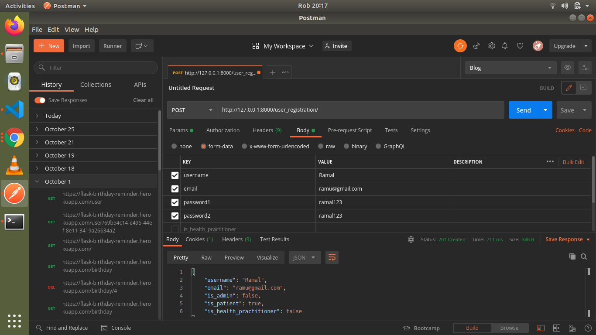
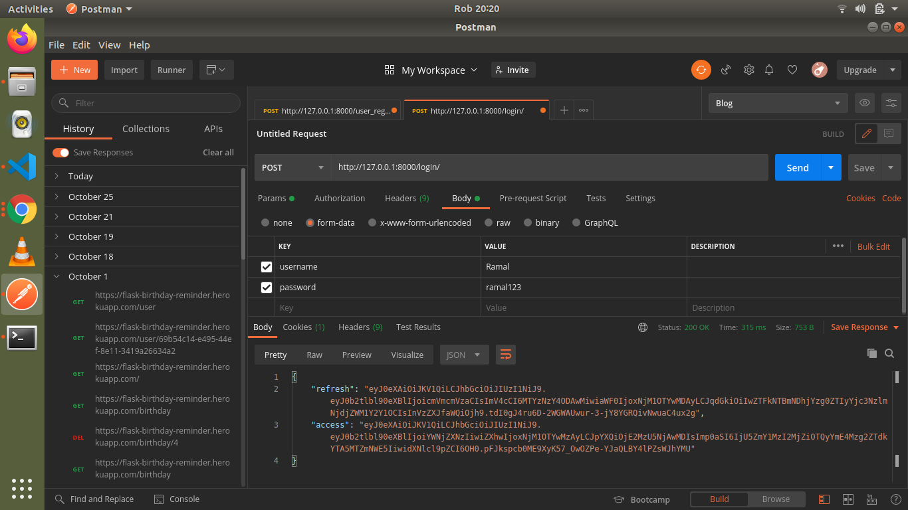
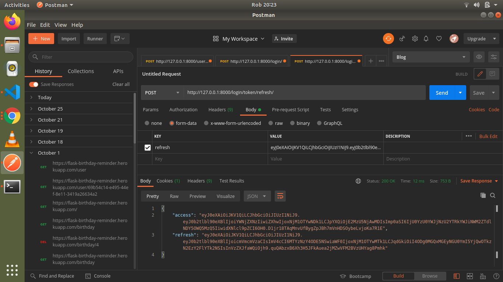
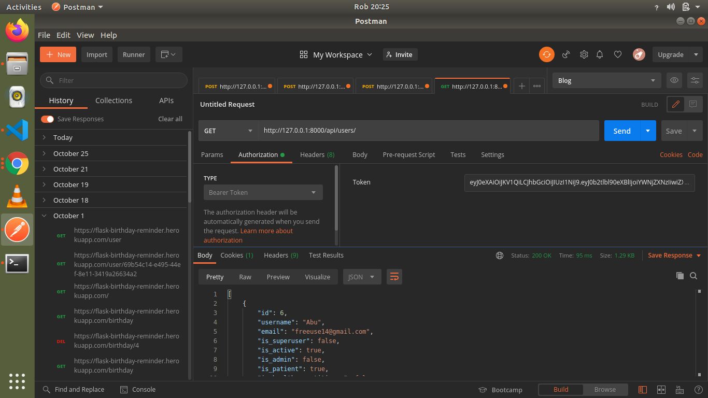

# AIL-PREDICT
#### Created By: **Alfred Warui**,**Langat Kipkirui**,**Maureen Ougo** 
## Description of the application
- The application allows users to get a diagnosis of what they are suffering from without visiting a hospital.
## Setup process
* Clone this repository using the link from the clone button
* Open the downloaded folder in a text editor of your preference
* Configure Postgresql database in your computer
* To install virtual environment:
```
$ python3.8 -m venv --without-pip virtual
```
* Activate virtual environment
```
$ source virtual/bin/activate
```
* Install latest pip version inside virtual environment
```
$ curl https://bootstrap.pypa.io/get-pip.py | python
```
* Installing the dependencies
```
$ pip install -r requirements.txt
```
* Starting up the application
```
$ python3.8 manage.py runserver
```

* Open port *http://127.0.0.1:8000/ * to interact with the application

## API Endpoints
For users:
- User registration endpoint: 
```
.../user_registration/
```
Example input: 


Choose the role to input for a user from *is_admin,is_patient,is_health_practitioner*.You cannot set all to true.After inputting one you don't need to input the rest because they have a default value of false.
- User login endpoint: 
As user you need to login to get bearer tokens in order to access other api endpoints.The user will get two rokens <b>access</b> and <b>refresh</b>.Use the <b>access</b> token to access other endpoints.
* Login endpoint
```
.../login/
```

Since the tokens expire after five minutes,a user needs to refresh them.
* Token refresh enpoint
```
.../login/token/refresh/
```

Usage of access token: 

  
## Known Bugs
There are known bugs.
## Technologies Used
* PYTHON
* DJANGO 3.2.8
* HTML5
* CSS
* BOOTSTRAP5
* POSTGRESQL
* MARKDOWN for the *README.md* file

### License
* *License under [MIT License](LICENSE)*
